<p align="center">
  
</p>

<h1 align="center">Neck</h1>

<p align="center">
  <strong>Destrave o fluxo do seu computador.</strong><br>
  Detecta o gargalo, recomenda uma única ação e acompanha o resultado sem colocar seus arquivos em risco.
</p>

<p align="center">
  <a href="https://github.com/VitorGirardi/neck/actions/workflows/build.yml"></a>
  <a href="https://github.com/VitorGirardi/neck/releases/latest"></a>
  
  
  
  <a href="CODE_SIGNING_POLICY.md"></a>
</p>

<p align="center">
  <a href="https://github.com/VitorGirardi/neck/releases/latest"><strong>Baixar a versão mais recente</strong></a>
  ·
  <a href="#instalação">Como instalar</a>
  ·
  <a href="#segurança-por-padrão">Proteções</a>
  ·
  <a href="TESTING.md">Testes</a>
  ·
  <a href="PRIVACY.md">Privacidade</a>
  ·
  <a href="CODE_SIGNING_POLICY.md">Assinatura</a>
</p>

> [!NOTE]
> O Neck 1.18.0 é uma **beta pública**. A suíte automatizada, o build público, os checksums e a análise do Microsoft Defender são exigidos antes de cada release, mas os binários ainda não possuem assinatura digital e a matriz em instalações limpas do Windows continua em andamento. Consulte o [estado dos testes](TESTING.md) antes de usar em um computador crítico.

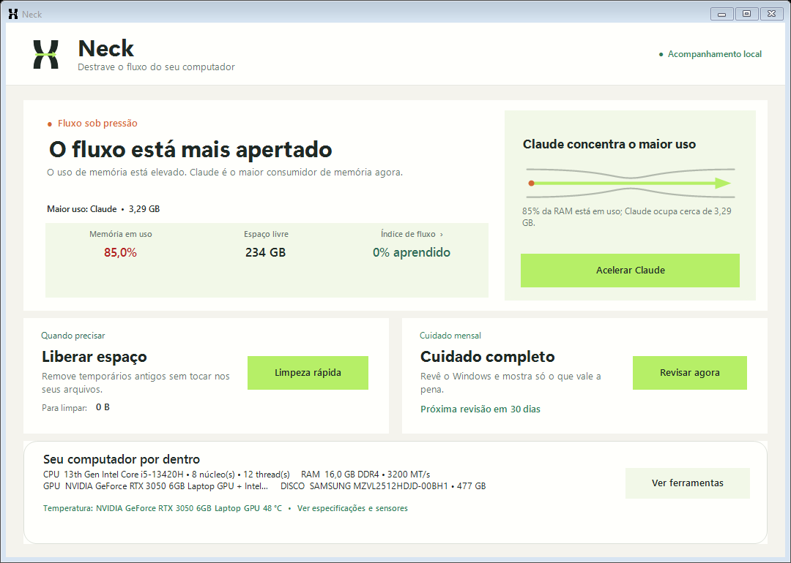

## Por que o Neck existe?

Quando um computador começa a travar, é comum encontrar ferramentas que prometem “liberar RAM”, aplicam alterações obscuras no Registro ou apagam arquivos sem explicar o impacto. O Neck segue outro caminho: **mede primeiro, explica a causa e mantém a decisão com você**.

Ele foi criado para quem quer responder três perguntas simples:

1. O que está deixando meu computador lento agora?
2. O que posso fazer sem arriscar meus arquivos ou o Windows?
3. Qual ação devo executar primeiro?

## Uma tela inicial que aponta o caminho

A página inicial foi organizada para qualquer pessoa entender por onde começar, mesmo sem conhecer termos técnicos:

- **Destravar agora** aponta a ação principal quando o Neck encontra um gargalo.
- **Índice de Fluxo** aprende o padrão saudável deste computador e mostra quando ele está diferente do próprio normal.
- **Neck Autopilot** pode antecipar pressão de RAM ou CPU e proteger temporariamente o aplicativo importante.
- **Liberar espaço** remove somente temporários conhecidos e mostra antes quanto pode ser liberado.
- **Cuidado completo** reúne os cuidados mensais do Windows em uma etapa separada.
- **Ferramentas** guarda recursos ocasionais como Neck Replay, Suporte, Drivers, Histórico, Modo Reunião, Inicialização e Preferências.

Assim, nenhuma ferramenta foi removida: as ações mais importantes aparecem primeiro e os controles ocasionais ficam em uma segunda camada.

As interações usam movimentos curtos e leves: janelas aparecem suavemente, botões respondem ao mouse e ao clique, cartões destacam o destino selecionado e tarefas exibem uma barra de atividade fluida. O botão principal pulsa somente diante de uma condição crítica e todas as animações contínuas param quando o Neck vai para a bandeja. A opção **Reduzir animações**, nas Preferências, mantém os realces sem movimento.

## Identidade Neck Flow

O nome Neck vem de **bottleneck**: um gargalo que limita o fluxo do computador. A identidade visual transforma essa ideia em uma linguagem funcional:

- o símbolo mostra duas paredes formando um gargalo e uma seta atravessando a restrição;
- os estados usam **Fluxo livre**, **Fluxo sob pressão** e **Gargalo agora**;
- a animação da tela principal representa o fluxo passando pelo ponto de restrição;
- **Segoe UI Variable Display** dá personalidade aos títulos sem perder a familiaridade do Windows; Segoe UI preserva a leitura dos textos;
- grafite representa estrutura, verde-lima mostra o fluxo, âmbar indica restrição e o fundo quente evita a aparência clínica de antivírus.

A animação ocorre por um intervalo curto após cada diagnóstico e não permanece consumindo recursos na bandeja.

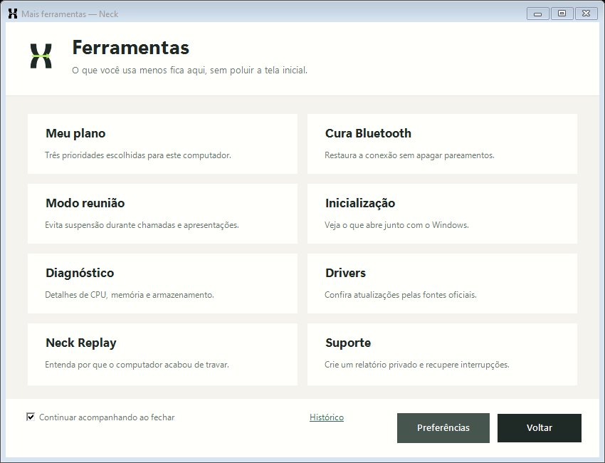

## Principais recursos

| Recurso | O que faz | Proteção principal |
| --- | --- | --- |
| **Neck Autopilot** | Projeta a tendência do próximo minuto e alivia concorrentes seguros antes do gargalo. | Desativado por padrão, exige duas previsões e restaura tudo automaticamente. |
| **Recuperação automática** | Mantém um diário transacional das prioridades temporariamente alteradas e corrige sobras após uma interrupção. | Confere PID, nome técnico e horário de início antes de restaurar; registros somem após a correção. |
| **Relatório de suporte** | Reúne versão, hardware resumido, métricas agregadas e falhas recentes em um arquivo revisável. | Omite usuário, computador, processos, janelas, caminhos pessoais e nunca envia o arquivo sozinho. |
| **Neck Baseline** | Aprende as faixas habituais deste computador e transforma desvios no Índice de Fluxo. | Salva somente agregados locais e não aprende leituras de incidente. |
| **Neck Replay** | Preserva os últimos cinco minutos em memória e explica por que o computador acabou de travar. | Só confirma pressão persistente, não grava conteúdo de janelas e não executa ações sozinho. |
| **Gargalo Guiado** | Distingue pressão de memória, CPU e armazenamento e recomenda a ação mais útil naquele momento. | Explica o motivo e mantém a confirmação com o usuário. |
| **Monitor Inteligente** | Ajusta o intervalo de leitura conforme a pressão, confirma persistência e reconhece a recuperação. | Não limpa, fecha ou altera aplicativos automaticamente. |
| **Escudo de Foco** | Reduz temporariamente a disputa de até três aplicativos pesados quando o aplicativo escolhido está em uso. | Só age sob pressão, protege comunicação e restaura ao trocar de janela. |
| **Hardware local** | Mostra CPU, GPU, RAM, discos, placa-mãe, drivers e temperaturas realmente disponíveis. | Não envia inventário e nunca estima sensores ausentes. |
| **Meu Plano Neck** | Cruza RAM, disco, temporários, inicialização e Windows Update para escolher três prioridades. | Não executa nenhuma ação automaticamente. |
| **Neck Guard** | Mostra a saúde do computador, CPU, RAM e os maiores consumidores de memória. | Diagnóstico somente leitura. |
| **Acelerar aplicativo** | Alterna automaticamente entre mais desempenho em uso e menor consumo em segundo plano. | Um único botão, duração de uma hora e restauração automática. |
| **Neck Boot** | Explica o que inicia com o Windows e quais itens opcionais merecem revisão. | Encaminha mudanças para a tela oficial do Windows. |
| **Modo Reunião** | Verifica o computador e impede suspensão durante uma apresentação. | Temporário, reversível e sem manutenção concorrente. |
| **Limpeza segura** | Remove temporários antigos e relatórios de erro conhecidos. | Preserva arquivos recentes, documentos, downloads e navegadores. |
| **Manutenção completa** | Reúne DISM, SFC e otimização da unidade. | Solicita administrador somente para a tarefa escolhida. |
| **Drivers e atualizações** | Mostra versões instaladas e abre fontes oficiais. | Não instala drivers silenciosamente. |

## Meu Plano Neck

Em vez de apresentar dezenas de métricas, o plano personalizado transforma o diagnóstico em três próximos passos. Cada recomendação informa o motivo, a urgência e o destino da ação.

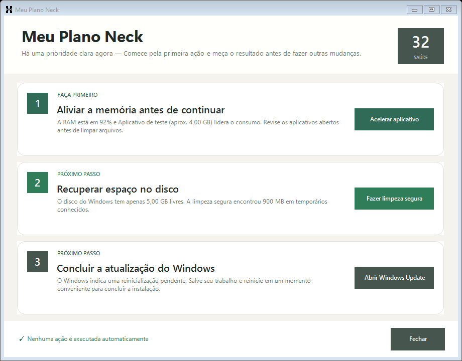

O plano pode encaminhar para Acelerar aplicativo, limpeza segura, Neck Boot, diagnóstico ou Windows Update. Confirmações e proteções continuam valendo em todas as etapas.

## Gargalo Guiado e Monitor Inteligente

O cartão principal agora funciona como uma orientação única, não como um painel cheio de decisões. A cada leitura, o Neck classifica o gargalo predominante:

- **Memória:** mostra o aplicativo que concentra o maior uso e já o destaca na tela de aceleração, com seu ícone local.
- **CPU:** encaminha para a escolha do aplicativo que precisa responder primeiro.
- **Armazenamento:** oferece a limpeza segura como primeira ação, sem incluir Lixeira ou manutenção administrativa.
- **Sem gargalo:** informa que o fluxo está normal e mantém a aceleração disponível como ação opcional.

O monitor trabalha de forma adaptativa: verifica a cada 60 segundos quando o computador está fluindo, a cada 30 segundos durante atenção e a cada 15 segundos em situação crítica. Um alerta só é liberado depois de três leituras consecutivas de pressão. Depois, duas leituras estáveis confirmam a recuperação e o intervalo volta ao normal.

Essas leituras e decisões acontecem localmente. O monitor não fecha processos, não executa limpeza e não modifica o Windows por conta própria.

## Neck Baseline: o padrão do seu computador

O **Neck Baseline** deixa de comparar todo computador com um número genérico. Ele aprende como RAM, CPU, paginação, fila e latência do armazenamento e temperaturas costumam se comportar **nesta máquina**. Depois transforma a comparação em um **Índice de Fluxo de 0 a 100**, visível e clicável no cartão principal.

O primeiro índice personalizado aparece após 30 leituras válidas — aproximadamente cinco minutos com o Neck aberto ou na bandeja — e continua se refinando com o uso. O aprendizado mantém dois contextos separados: uso normal e Modo Reunião. Assim, uma chamada naturalmente mais pesada não redefine o restante do dia.

Antes de atualizar o padrão, o Neck verifica a leitura. Travamentos, pressão absoluta de RAM, disputa de CPU, espera de disco, temperatura crítica, janela sem resposta e desvios já identificados ficam fora das médias. Isso impede que um problema recorrente seja gradualmente tratado como “normal”.

No disco são salvos apenas contagem, média, variação e faixas numéricas em `%LOCALAPPDATA%\Neck\baseline-v1.txt`. Nomes de aplicativos, amostras individuais, títulos de janelas e uma linha do tempo de uso não fazem parte desse arquivo.

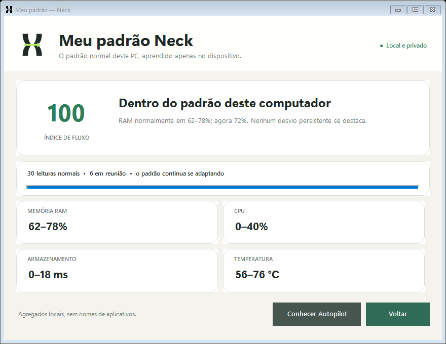

## Neck Autopilot: proteção antes do gargalo

O **Neck Autopilot** usa o padrão local do Baseline e uma sequência curta mantida somente na memória para projetar a direção dos próximos 60 segundos. Ele só começa depois das 30 leituras válidas do primeiro padrão e permanece desativado até a pessoa escolher ativá-lo.

Uma intervenção automática exige duas previsões consecutivas de pressão real de RAM ou CPU. Nesse caso, o Neck pode aplicar EcoQoS, prioridade de memória reduzida e RAM Park em **no máximo dois aplicativos seguros em segundo plano**. Aplicativos de comunicação, áudio, apresentação, transmissão, processos do Windows, o aplicativo em primeiro plano e o próprio Neck ficam protegidos pela lista de exclusão.

As mudanças são temporárias: o aplicativo volta a responder normalmente ao receber foco, e todas as alterações são restauradas depois de três leituras estáveis, ao desativar o Autopilot, ao iniciar uma aceleração manual, ao encerrar o Neck ou após o limite de dez minutos. Tendências de disco ou temperatura são apenas explicadas; o Autopilot não aplica uma intervenção automática quando não há uma ação genérica segura.

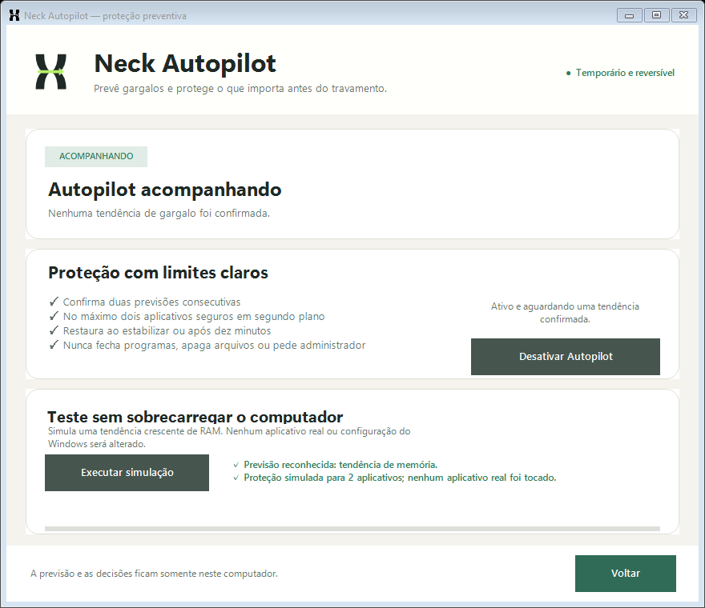

### Teste seguro do Autopilot

1. Na tela principal, clique em **Índice de Fluxo ›** e depois em **Conhecer Autopilot**.
2. Clique em **Executar simulação**. O Neck reproduz seis leituras virtuais de RAM; nenhum aplicativo real é alterado.
3. O resultado esperado é **Previsão reconhecida: tendência de memória** e **Proteção simulada para 2 aplicativos**.
4. Para testar o acompanhamento real, ative o Autopilot e mantenha o Neck aberto ou na bandeja. O Índice de Fluxo personalizado precisa já estar disponível.
5. Você pode desativá-lo na mesma tela ou em **Preferências**; qualquer proteção real é restaurada imediatamente.

## Suporte e recuperação após interrupções

Antes de aplicar uma prioridade, EcoQoS ou prioridade de memória temporária, o Neck 1.17 registra localmente o estado original. Uma restauração normal remove a entrada imediatamente. Se o processo do Neck cair ou o computador desligar no meio da operação, a próxima abertura confere a identidade e o horário de início de cada processo antes de devolver o estado anterior. Processos já encerrados ou reutilizados por outro aplicativo são descartados sem alteração.

Em **Mais ferramentas → Suporte**, o botão **Criar relatório** gera um arquivo em `Documentos\Neck\Suporte`. Ele contém versão do Neck e do Windows, especificações resumidas, médias de RAM/CPU, contagens de recuperação e eventos técnicos recentes. Nomes de usuário, computador, aplicativos, títulos de janela, caminhos pessoais, documentos, senhas e conteúdo da tela ficam de fora. O arquivo nunca é enviado automaticamente e deve ser revisado antes de ser anexado a uma issue pública.

Falhas inesperadas da interface também passam por uma proteção global: o Neck registra o erro sanitizado, encerra suas intervenções temporárias e informa que a restauração foi executada. Isso não tenta esconder o problema; preserva o computador e deixa evidência local para correção.

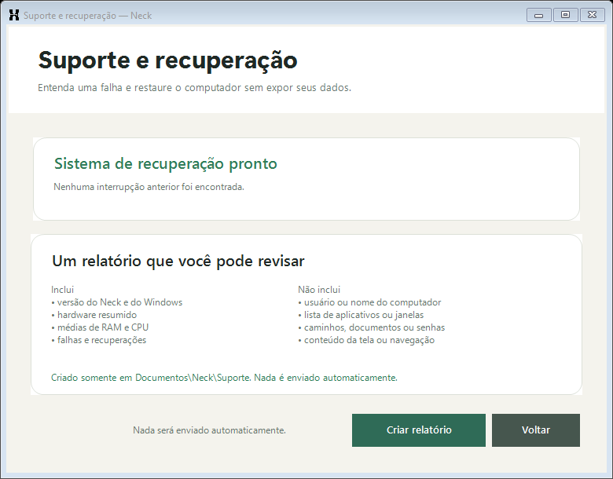

## Neck Replay: a caixa-preta do gargalo

O **Neck Replay** responde à pergunta que o Gerenciador de Tarefas normalmente não consegue responder depois que um pico termina: **“por que o computador travou alguns minutos atrás?”**

A cada dez segundos, uma janela circular mantida somente na memória combina:

- RAM usada, memória realmente disponível, commit e leituras de paginação;
- uso e fila da CPU, incluindo o aplicativo mais associado ao pico;
- atividade, fila e latência do armazenamento;
- resposta da janela em primeiro plano;
- maior temperatura local confiável já exposta pelo inventário de hardware.

O classificador exige combinação causal e persistência. Por exemplo, 74% de RAM com vários gigabytes disponíveis não vira incidente apenas por parecer um número alto. Pressão de memória só é confirmada quando a perda de folga, o commit ou a paginação sustentam a hipótese. Picos graves precisam de duas leituras; os demais, de três. Duas leituras estáveis encerram o incidente e preservam a explicação até que a janela seja descartada.

Quando o fluxo volta, o cartão principal oferece **Ver o que aconteceu**. A tela apresenta duração, pico, aplicativo associado, evidência técnica e uma única próxima ação segura. O Replay não fecha programas, não limpa arquivos e não altera prioridades automaticamente.

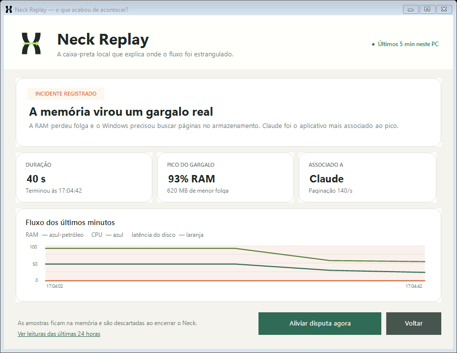

## Hardware e temperaturas

A tela principal apresenta um resumo compacto do computador: processador, memória instalada, placas de vídeo, armazenamento e a maior temperatura disponível. Clicar no resumo abre as especificações completas, incluindo núcleos e threads da CPU, frequência da RAM, módulos instalados, versões dos drivers de vídeo, placa-mãe e discos físicos.

As temperaturas seguem uma ordem de fontes locais:

1. sensores já publicados por LibreHardwareMonitor ou OpenHardwareMonitor, quando algum deles estiver disponível;
2. driver NVIDIA por meio do `nvidia-smi` instalado junto ao driver;
3. zonas térmicas ACPI fornecidas pelo firmware ao Windows.

Uma zona ACPI é identificada como temperatura do sistema e não como CPU ou GPU. Quando nenhum sensor compatível está exposto, o Neck mostra **Sensor não disponibilizado**. Ele não inventa, calcula ou estima temperaturas.

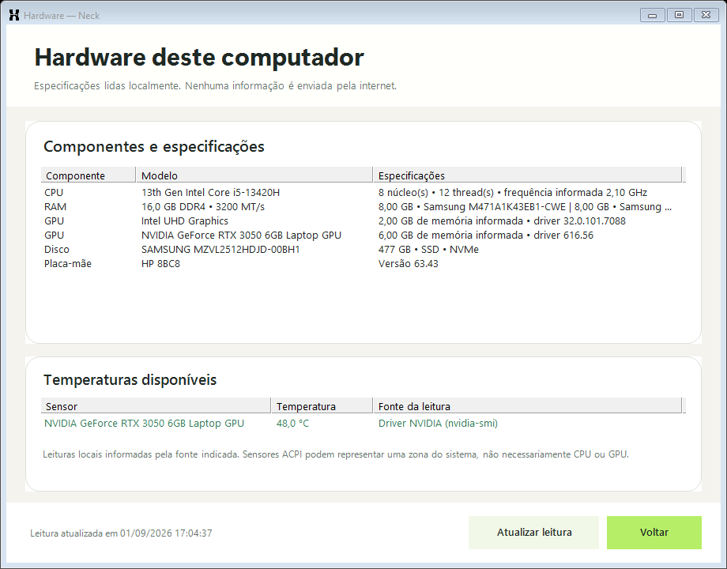

## Cura Bluetooth

A **Cura Bluetooth** foi criada para a falha intermitente em que o botão de Bluetooth some, o rádio deixa de encontrar acessórios ou um dispositivo conhecido para de conectar. Ela fica em **Mais ferramentas**, fora da tela principal.

Ao abrir a central, o Neck verifica localmente:

- se o Windows ainda reconhece o adaptador Bluetooth físico;
- o fabricante, a versão e a data do driver assinado;
- o código de erro informado pelo Gerenciador de Dispositivos;
- o Serviço de Suporte a Bluetooth e a associação de dispositivos.

Quando o hardware está saudável e apenas a chave está desligada, o Neck abre a página oficial do Bluetooth no Windows. Nesse estado ele **não reinicia o driver**, não pede administrador e atualiza o diagnóstico quando você volta à central.

Somente quando existe falha real no adaptador ou nos serviços, **Tentar corrigir agora** pede permissão de administrador e executa uma sequência fechada e auditável:

1. interrompe temporariamente o Serviço de Suporte a Bluetooth;
2. reinicia somente o adaptador físico validado pelo driver e pelo Windows;
3. força uma nova detecção de hardware;
4. restaura os serviços necessários e confirma o estado final.

O Neck também consulta os eventos `BTHUSB` do Windows. Se o rádio reaparecer e o driver voltar a cair ao ser ligado, a interface não declara um falso sucesso: mostra a falha, interrompe novas reinicializações por alguns minutos e encaminha para os drivers oficiais. Essa proteção anti-loop evita repetir indefinidamente o ciclo “aparece, tenta ligar, desaparece”.

Quando o histórico confirma esse ciclo, a central oferece um **Reset elétrico guiado**. O Neck restaura primeiro qualquer otimização temporária e solicita ao Windows um desligamento completo, sem `/hybrid` e sem `/f`. Depois que luzes e ventoinhas apagarem, a própria tela orienta a etapa que software não consegue executar: retirar o carregador, manter o botão de ligar pressionado por 20 segundos, reconectar e ligar o computador. O procedimento segue o [desligamento documentado pela Microsoft](https://learn.microsoft.com/windows-server/administration/windows-commands/shutdown) e a [orientação de power reset da HP](https://support.hp.com/us-en/document/ish_3974055-3873564-16).

O reset elétrico não é restauração de fábrica, não reinstala o Windows e não apaga arquivos. Ele só começa depois que a pessoa marca que salvou o trabalho e confirma novamente o desligamento. O Neck não afirma conseguir descarregar capacitores por software: essa parte permanece física e explícita.

O reparo usa o [`PnPUtil`](https://learn.microsoft.com/windows-hardware/drivers/devtest/pnputil-command-syntax), ferramenta nativa recomendada pela Microsoft para reiniciar dispositivos e examinar alterações de hardware. O Neck não remove acessórios pareados, não apaga entradas do Registro, não desinstala drivers e não reinicia o computador. Fones, mouse ou teclado Bluetooth podem se desconectar por alguns segundos durante a cura.

Se o rádio continuar indisponível, a central apresenta o ponto em que o reparo parou e oferece acesso às atualizações opcionais de driver do Windows.

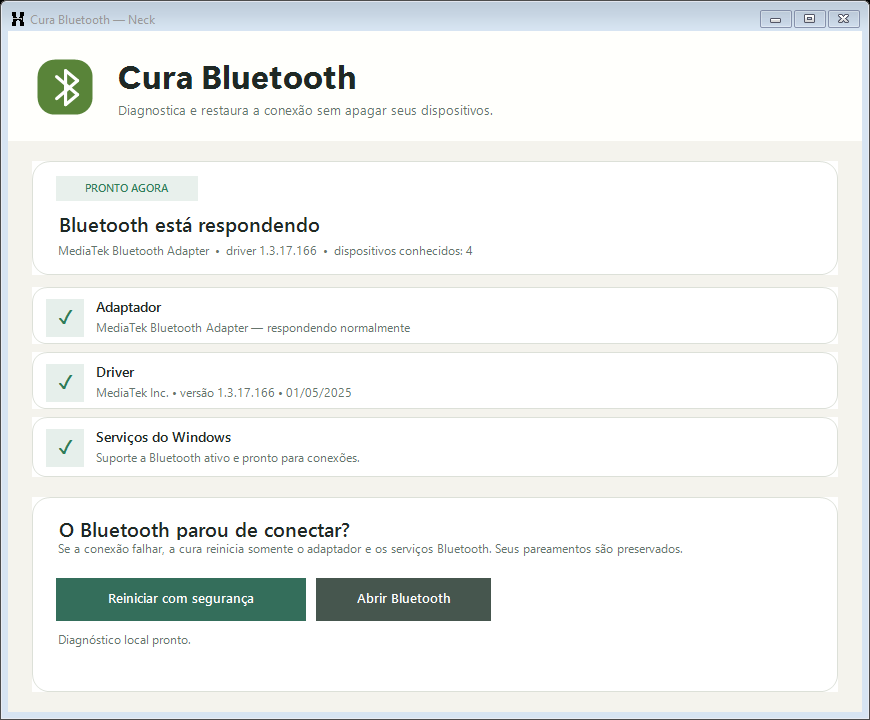

## Acelerar um aplicativo

Essa é a função principal do Neck. Ela foi desenhada para funcionar sem exigir conhecimento sobre CPU, prioridade ou gerenciamento de memória:

1. Clique em **Acelerar app**.
2. Selecione o aplicativo importante.
3. Clique em **Acelerar por 1 hora**.
4. Volte ao aplicativo e use-o normalmente.

O Neck cuida das mudanças sozinho:

- **Enquanto você usa o aplicativo:** ele recebe prioridade para responder melhor.
- **Se outros aplicativos estiverem disputando recursos:** o Escudo de Foco reduz temporariamente até três concorrentes pesados em segundo plano.
- **Quando fica em segundo plano:** após 15 segundos, passa a usar menos CPU, energia e memória física.
- **Quando você volta:** recebe prioridade novamente em até 2 segundos.
- **Depois de uma hora ou ao clicar em Parar:** todas as configurações anteriores são restauradas.

O Escudo de Foco considera memória e atividade recente de CPU. Ele só seleciona aplicativos com janela própria, nunca o aplicativo escolhido, e mantém uma lista conservadora de exceções para aplicativos dedicados conhecidos de comunicação, áudio, vídeo, transmissão e ferramentas do Windows. O Escudo fica suspenso durante o Modo Reunião. Ao trocar de janela, os concorrentes recuperam imediatamente suas configurações anteriores.

Após a ativação, o Neck compara a memória disponível e o uso físico da família do aplicativo durante 18 segundos de uso real em primeiro plano. A contagem só começa quando você volta ao aplicativo e pausa se trocar de janela. O resultado informa o que realmente foi observado — inclusive quando o uso permaneceu semelhante — e quantos processos receberam a configuração. Ele não transforma essa leitura em uma promessa artificial de velocidade.

A tela principal mostra apenas o nome, o uso de memória e uma situação compreensível, como **Disponível**, **Mais rápido agora** ou **Economizando memória**. Fechamento do aplicativo, Gerenciador de Tarefas e controle manual de segundo plano ficam em **Mais opções**.

Os ícones exibidos na lista são extraídos dos executáveis locais, como no Gerenciador de Tarefas. Nenhum ícone é baixado e aplicações protegidas usam um símbolo neutro.

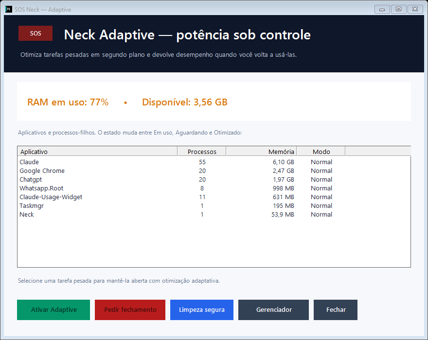

## Manutenção guiada

As tarefas de manutenção aparecem em linhas inteiras clicáveis, com checkbox alinhado, explicações em linguagem comum e destaque apenas para opções selecionadas. Termos como DISM, SFC e TRIM continuam na implementação, mas não são exigidos para entender a escolha.

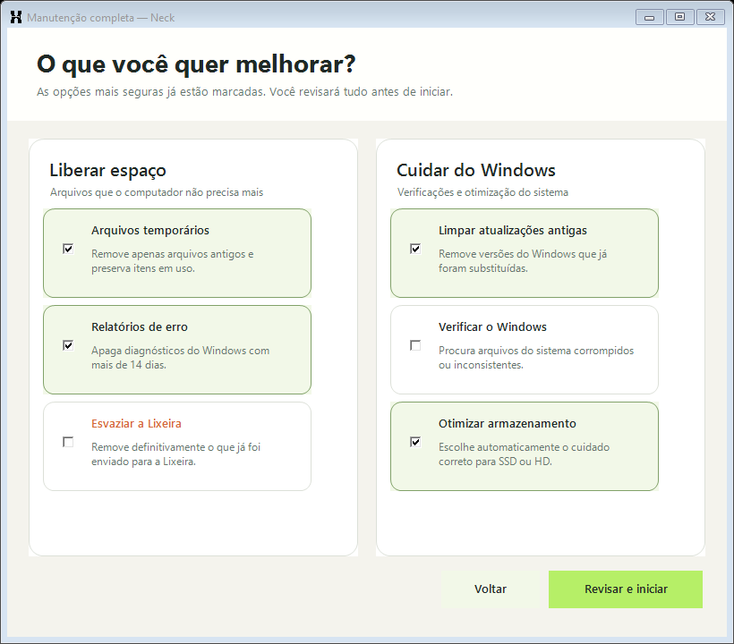

<details>
<summary>Ver os controles avançados separados da experiência principal</summary>
<br>

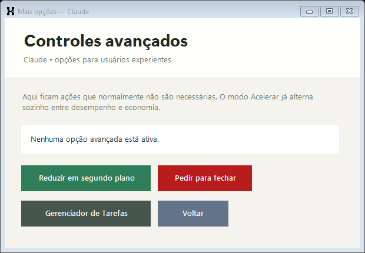

</details>

## Como funciona por dentro

O botão Acelerar combina três motores que continuam separados no código:

- **Turbo:** enquanto uma janela da família está em primeiro plano, usa `ABOVE_NORMAL_PRIORITY_CLASS` para melhorar a resposta durante disputa por CPU.
- **Adaptive:** em segundo plano, usa prioridade abaixo do normal, EcoQoS, baixa prioridade de memória e RAM Park.
- **Escudo de Foco:** enquanto o alvo está em primeiro plano e existe pressão de RAM ou CPU, aplica o Adaptive somente a até três concorrentes elegíveis e restaura tudo ao perder o foco.

A análise considera a **família inteira de processos**, inclusive filhos com nomes diferentes como `chrome`, `node` ou `msedgewebview2`. Subprocessos novos também são detectados. Cada valor anterior é preservado individualmente.

O **RAM Park** pede ao Windows para retirar páginas ociosas do working set — a parte do aplicativo residente na RAM física. Isso não apaga estado nem reduz necessariamente a memória privada comprometida; o primeiro retorno pode demorar enquanto o Windows recarrega dados sob demanda.

A implementação utiliza as APIs documentadas [`SetPriorityClass`](https://learn.microsoft.com/windows/win32/api/processthreadsapi/nf-processthreadsapi-setpriorityclass), [`SetProcessInformation`](https://learn.microsoft.com/windows/win32/api/processthreadsapi/nf-processthreadsapi-setprocessinformation), [`MEMORY_PRIORITY_INFORMATION`](https://learn.microsoft.com/windows/win32/api/processthreadsapi/ns-processthreadsapi-memory_priority_information) e [`EmptyWorkingSet`](https://learn.microsoft.com/windows/win32/api/psapi/nf-psapi-emptyworkingset) do Windows.

## Segurança por padrão

- Não usa “limpeza de RAM” artificial nem encerra processos em massa.
- Não aplica o Neck Adaptive a componentes críticos do Windows nem ao próprio Neck.
- Não usa prioridade Alta ou Tempo real no Neck Turbo e não altera o plano de energia.
- Não aplica o Escudo de Foco sem pressão, em processos protegidos ou em aplicativos conhecidos de comunicação, áudio, vídeo e transmissão.
- Não inventa temperaturas de CPU/GPU quando o firmware ou o driver não expõe um sensor compatível.
- Não confunde RAM estacionada com memória definitivamente liberada e apresenta somente o resultado observado.
- Não aplica ajustes genéricos no Registro para prometer desempenho.
- Não apaga documentos, fotos, downloads, senhas ou dados de navegadores.
- Não esvazia a Lixeira sem uma seleção explícita.
- Não baixa nem executa atualizações do Neck silenciosamente.
- Não armazena tokens ou credenciais do GitHub.
- Não reinicia nem desliga o computador automaticamente; o Reset elétrico guiado exige duas confirmações explícitas.
- Não instala drivers automaticamente; utiliza Windows Update e páginas oficiais.
- Não remove pareamentos nem desinstala drivers durante a Cura Bluetooth.
- Reinicia somente um adaptador Bluetooth físico validado pelo inventário do Windows.
- Mantém uma lista fechada de tarefas administrativas permitidas.
- Salva relatórios de manutenção em `Documentos\Neck\Relatorios`.
- Registra cada ajuste reversível antes de aplicá-lo e tenta restaurar qualquer pendência na próxima abertura.
- Cria relatórios de suporte somente quando solicitado e nunca os envia automaticamente.

O Neck normalmente é executado como usuário comum. A janela do UAC aparece somente quando você escolhe uma operação do Windows que realmente exige privilégios elevados, como DISM, SFC, otimização da unidade ou criação de ponto de restauração.

## Instalação

### Instalador recomendado

1. Abra a página de [releases](https://github.com/VitorGirardi/neck/releases/latest).
2. Baixe `Neck-Setup-1.18.0.exe` e o arquivo correspondente `.sha256`.
3. Opcionalmente, confira a integridade no PowerShell:

```powershell
Get-FileHash .\Neck-Setup-1.18.0.exe -Algorithm SHA256
```

4. Execute o instalador e siga as instruções. O Neck será adicionado ao menu Iniciar e poderá ser removido normalmente pelas configurações de Aplicativos do Windows.

### Versão portátil

Baixe `Neck.exe` na mesma release e execute-o diretamente. Nenhuma instalação é necessária. As preferências e o histórico continuam armazenados no perfil local do Windows.

> [!IMPORTANT]
> Os binários da versão 1.18.0 ainda não possuem assinatura digital. Até que a aprovação da SignPath Foundation seja concluída e uma release mostre `Status: Valid`, o Windows pode exibir “Editor desconhecido” ou uma proteção do SmartScreen. Sempre baixe o Neck desta página de releases e compare o SHA-256 publicado.

## Assinatura digital

O repositório está preparado para solicitar assinatura gratuita de código para projeto open source pela [SignPath Foundation](https://signpath.org/). A [política de assinatura](CODE_SIGNING_POLICY.md) documenta responsáveis, origem dos artefatos, algoritmos, validação e resposta a incidentes.

A cadeia preparada não permite assinar apenas a embalagem e deixar o aplicativo interno sem proteção:

1. os autotestes rodam em uma máquina Windows limpa;
2. o `Neck.exe` é compilado e enviado à SignPath;
3. o instalador é montado contendo esse executável já assinado;
4. o instalador também é assinado;
5. o workflow exige publicador esperado, timestamp e `Status: Valid` antes de recalcular os checksums.

O workflow de assinatura é manual e permanece inativo sem as credenciais oficiais. Tokens e chaves não ficam no código; a chave privada permanece no HSM do provedor. Até a aprovação, o badge e esta seção continuam dizendo **em preparação**. A ativação começa pelo [formulário oficial da SignPath Foundation](https://signpath.org/apply.html); os secrets e variables necessários estão listados na [política de assinatura](CODE_SIGNING_POLICY.md#ativação-depois-da-aprovação).

Para verificar uma futura release assinada:

```powershell
Get-AuthenticodeSignature .\Neck.exe | Format-List Status,SignerCertificate,TimeStamperCertificate
```

Consulte também a [política de segurança](SECURITY.md) e a [política de privacidade completa](PRIVACY.md).

## Privacidade

O Neck não possui telemetria e não envia métricas do computador para servidores externos.

A descrição completa do tráfego iniciado pelo usuário, dos dados locais e da exclusão dessas informações está em [PRIVACY.md](PRIVACY.md).

Dados mantidos localmente:

- Preferências e histórico do Guard: `%LOCALAPPDATA%\Neck`
- Padrão estatístico agregado: `%LOCALAPPDATA%\Neck\baseline-v1.txt`
- Relatórios de manutenção: `Documentos\Neck\Relatorios`
- Histórico do Guard: somente as últimas 24 horas

A internet é utilizada apenas quando você solicita uma verificação de versão ou abre uma fonte oficial, como GitHub, Windows Update ou a página de um fabricante.

## Requisitos

- Windows 10 versão 2004 ou mais recente, ou Windows 11, ambos de 64 bits
- .NET Framework 4.8
- Aproximadamente 10 MB de espaço para instalação
- Permissão de administrador somente para operações avançadas selecionadas

## Compilação

O projeto utiliza o compilador C# do .NET Framework disponível no Windows e não depende de pacotes externos para gerar o aplicativo.

```powershell
git clone https://github.com/VitorGirardi/neck.git
cd neck
.\test.ps1
.\build.ps1
```

Saída principal: `dist\Neck.exe`.

Para gerar o instalador, instale o [Inno Setup 6](https://jrsoftware.org/isinfo.php) e execute:

```powershell
.\build-installer.ps1
```

O comando produz o instalador, o executável portátil e os respectivos checksums SHA-256. Cada push e pull request para `main` também executa os autotestes, compila o aplicativo e gera os artefatos no GitHub Actions.

O workflow manual `.github/workflows/sign-release.yml` implementa a cadeia em duas fases para SignPath. Ele só funciona depois da aprovação do projeto e da configuração descrita em [CODE_SIGNING_POLICY.md](CODE_SIGNING_POLICY.md); builds comuns continuam unsigned e são identificados dessa forma pela verificação de pacote.

## Estrutura do projeto

```text
Program.cs                 Interface principal e manutenção segura
SystemMonitoring.cs        Diagnóstico de CPU, memória, disco e reunião
GuardMonitoring.cs         Monitoramento contínuo, histórico e bandeja
BottleneckGuidance.cs      Gargalo Guiado, monitor adaptativo e medição de resultado
NeckReplay.cs              Caixa-preta, PDH, classificação causal e incidentes em memória
ReplayForm.cs              Explicação visual e linha do tempo dos últimos cinco minutos
NeckBaseline.cs            Aprendizado estatístico local, contextos e Índice de Fluxo
BaselineForm.cs            Faixas habituais e progresso do padrão personalizado
Autopilot.cs               Previsão de tendência, limites e proteção preventiva reversível
AutopilotForm.cs           Consentimento, estado e simulação segura do Autopilot
RecoverySafety.cs          Diário transacional, recuperação de processo e proteção global contra falhas
SupportReport.cs           Eventos sanitizados, relatório local e interface de suporte
SosMode.cs                 Alívio seguro de sobrecarga
EfficiencyMode.cs          Otimização adaptativa de CPU, memória e EcoQoS
TurboMode.cs               Prioridade de foco temporária e reversível
FocusMode.cs               Orquestra Turbo, Adaptive e Escudo de Foco
FocusShield.cs             Proteção temporária contra concorrentes pesados
ProcessFamily.cs           Descoberta de processos-filhos e RAM real da família
HardwareInfo.cs            Inventário local e fontes de temperatura
HardwareForm.cs            Especificações e sensores em interface dedicada
BluetoothDoctor.cs         Diagnóstico e motor de reparo seguro do Bluetooth
BluetoothForm.cs           Central visual da Cura Bluetooth
BluetoothRadio.cs          Leitura local do estado ligado/desligado do rádio
BluetoothPowerReset.cs     Plano validado de desligamento completo
BluetoothPowerResetForm.cs Assistente visual para a etapa física do power reset
StartupAnalysis.cs         Análise somente leitura da inicialização
PersonalPlan.cs            Motor e interface das três prioridades
ElevatedOperations.cs      Executor administrativo com lista fechada
PreferencesAndUpdates.cs   Preferências e consulta manual de versão
SelfTest.cs                Testes funcionais e verificações visuais
verify-package.ps1         Confere versão, checksums e estado de assinatura
verify-authenticode.ps1    Exige assinatura, publicador e timestamp válidos
write-checksums.ps1        Recalcula SHA-256 após o último estágio do pacote
installer/Neck.iss         Definição do instalador para Windows
.github/workflows/         Build comum e assinatura SignPath condicionada
```

## Como contribuir

Relatos de bugs, ideias e pull requests são bem-vindos.

Leia o [guia de contribuição](CONTRIBUTING.md) para configurar o ambiente, executar a suíte e entender as proteções obrigatórias do projeto.

- Antes de abrir uma issue, verifique se o problema já foi relatado.
- Explique a versão do Windows, a versão do Neck e como reproduzir o comportamento.
- Mudanças que apagam dados, encerram processos à força ou enfraquecem as confirmações de segurança não serão aceitas.
- Execute `.\test.ps1` antes de enviar um pull request.

Use as [issues do GitHub](https://github.com/VitorGirardi/neck/issues) para bugs e sugestões. Para uma vulnerabilidade que não deve ser divulgada publicamente, utilize o recurso **Report a vulnerability** na aba Security do repositório quando ele estiver disponível.

Contribuições também devem respeitar a [política de segurança](SECURITY.md), a [privacidade](PRIVACY.md) e a [política de assinatura](CODE_SIGNING_POLICY.md).

## Limites honestos

O Neck ajuda a diagnosticar e reduzir sobrecarga, mas não substitui backup, antivírus, suporte técnico ou uma atualização de hardware. Ele não consegue transformar falta física de RAM em memória adicional e não promete acelerar todos os computadores.

As causas mostradas pelo Replay são inferências locais baseadas na coincidência e persistência de sinais do Windows. Elas explicam a evidência observada, mas não substituem uma análise especializada de hardware quando a falha é intermitente ou física.

O Índice de Fluxo é uma comparação estatística, não um benchmark universal. Nos primeiros minutos ele ainda está aprendendo; mudanças grandes de hardware ou de rotina levam algum tempo para se refletir nas faixas.

O Autopilot faz uma projeção estatística de curto prazo, não uma promessa de que todo gargalo será evitado. Ele pode preferir não agir quando não existe um concorrente seguro ou quando a causa é disco, temperatura, hardware ou um aplicativo já em primeiro plano.

Resultados dependem do estado do Windows, dos aplicativos abertos e do hardware. Leia cada recomendação e mantenha backup dos arquivos importantes antes de qualquer manutenção do sistema.

## Roadmap

- [x] Diagnóstico inteligente e histórico local
- [x] Modo Reunião e monitoramento na bandeja
- [x] Aceleração com um botão e opções técnicas separadas
- [x] Tela inicial guiada e central separada para ferramentas ocasionais
- [x] Animações leves, estados interativos e opção de redução de movimento
- [x] Identidade Neck Flow, ícones locais e manutenção guiada
- [x] Instalador, preferências e checksums
- [x] Neck Boot e Meu Plano Neck
- [x] Neck Adaptive com foco, EcoQoS e prioridade de memória
- [x] RAM Park e otimização por família de processos
- [x] Neck Turbo e detecção de pressão persistente de CPU
- [x] Gargalo Guiado com recomendação única e aplicativo destacado
- [x] Monitor Inteligente adaptativo com confirmação de pressão e recuperação
- [x] Medição honesta do resultado antes/depois da aceleração
- [x] Escudo de Foco sensível a RAM e CPU, com restauração imediata
- [x] Inventário de hardware e temperaturas locais com fontes explícitas
- [x] Cura Bluetooth com diagnóstico, reinício seletivo e nova detecção
- [x] Proteção anti-loop e Reset elétrico guiado com desligamento não forçado
- [x] Neck Replay com caixa-preta local, classificação causal e linha do tempo
- [x] Neck Baseline com padrão local, Índice de Fluxo e contexto de reunião
- [x] Neck Autopilot com previsão de curto prazo, consentimento e restauração automática
- [x] Recuperação após interrupções e relatório de suporte sanitizado
- [x] Políticas, validação e pipeline de assinatura em duas fases
- [x] Beta pública com checksums, verificação antimalware e documentação de testes
- [ ] Concluir matriz de instalação limpa no Windows 10 e 11
- [ ] Aprovação SignPath e primeira release com Authenticode válido
- [ ] Aprimorar classificações de aplicativos com contribuições da comunidade
- [ ] Internacionalização da interface

## Licença

O Neck é software open source distribuído sob a [licença MIT](LICENSE).

---

<p align="center">
  Feito com cuidado para tornar a manutenção do Windows mais compreensível, segura e auditável.
</p>
